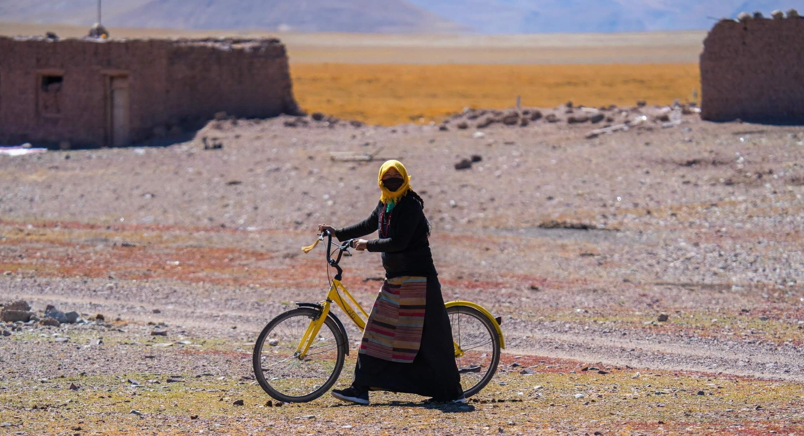
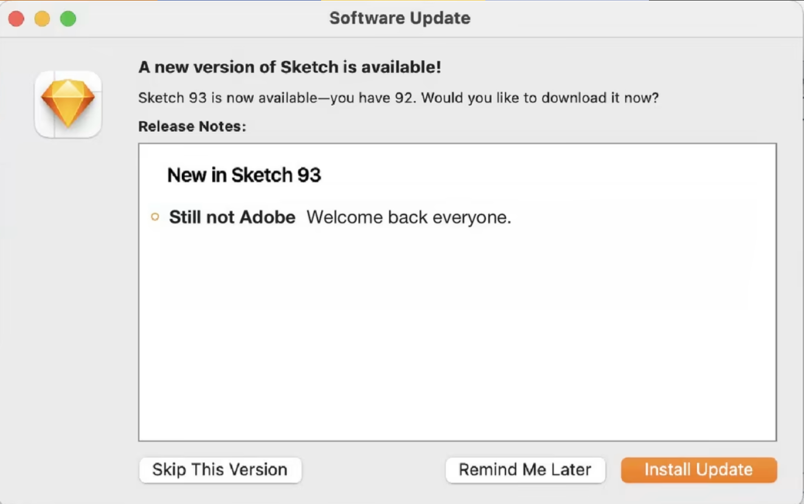

2021-10-07 阿里地区-西藏

Hi，见信好，这是 321来信发出的第 19 封信。过去的这一周新增了 18 位读者订阅，谢谢你们读我的信。这周二信没写完，还好我在出来旅行的路上完成了剩余部分，是我第一次在旅途中给你们写信，祝你们假期愉快。

本期包含以下内容：

- 气候变暖和极热天气的原因是什么
- 如何把一篇文章描写得更有张力、更具冲突
- Adobe 收购 Figma 的另一面
- 关键字：气候变暖、然而但是、 Adobe、Figma、静默离职

## 👍 推荐：

[On Adobe Acquiring Figma](https://build.typogram.co/p/on-adobe-acquiring-figma) 来自 typogram.co

Adobe 收购 Figma 的另一面

这篇文章从另一个角度去分析了 Adobe 收购 Figma 事件，事情可能并没有想象得那么简单。

作者曾经为 Adobe 工作过 6 年，其中 1.5 年在 Adob​​e XD，另外 5 年多时间在另一个 Adob​​e 收购的 Typekit 项目上，并且持有大量的 Adobe 股票，他表示在收购消息发出的那一刻，他首先感受了到的是对他股票账户的打击。是的，收购消息爆出的当天，Adobe 股价下跌了 20%。

为什么其他投资者讨厌这次收购，并且会导致股价暴跌？

答案很简单就是 200 亿美元的收购价太贵了，股东并不买账。他认为这不是一个公开公平的收购谈判，是 Adobe 在祈求收购 Figma，而不是 Figma 试图加入 Adobe。作者认为 Figma 的实际价值约为 50 亿美元，200 亿美元收购价被高估了四倍。

另外 Adobe 真的需要 Figma 吗？

XD 虽然不如 Figma 那样成功，但据 [uxtools 的调查问卷](https://uxtools.co/survey-2021/)显示 Adobe XD 目前是第三受欢迎的 UI 设计工具和第二受欢迎的 UI 原型制作工具，前面两位估计大家也能猜到分别是 Sketch 和 Figma。

另外在这个报告中我看到至少 70% 的设计人员使用 Mac，这也是为什么 Sketch 并没有像 Figma 使用 web 主打协作和无障碍，而是专注于 MacOS 市场的原因。

作者认为这次收购的决策者没有仔细分析这两个类似的产品，以及自家开发了运作了 7 年的设计产品与 Figma 相比缺少了什么， Adobe XD 的 “Live Co-editing”支持多人协作模式已经上线了3年之久。

关于谁是 David Wadhwani？

在 Dylan 针对收购的公开声明中，他声称收购之后他仍然将作为 Figma 的 CEO，他将汇报给 David Wadhwani。 Figma 将成为 Creative Cloud 的一部分，但蹊跷的是 Figma CEO 不向 Creative Cloud 负责人汇报。他认为很有可能是 David 主导或负责了这次收购，据网上资料显示，David曾是公司 Greylock 的合伙人，这个公司曾在 A、B、C、D 和 E 轮投资中投资了 Figma! Figma A 轮的价格为每股 0.2 美元，它在收购交易中的收益翻了 200 倍。

创业公司被大公司收购到底是好事还是坏事？这很难说，有些大公司的收购对被收购对象可能是毁灭性打击，有很多很好的产品被收购后由于各种原因逐渐被抛弃遗忘，当然也有一些成功的例子，例如 YouTube 被谷歌收购后依然保持较好的独立发展。但即使 Adob​​e 尽可能保持 Figma 的独立性，它的发展和增长速度也会慢得多，因为不会再有风险投资资金涌入，这次收购唯一的赢家是那些风投资本家。

由于我平时主要是从事开发工作，会使用到 Figma， 但很少使用它来做设计方面的工作，不清楚这次的收购对 Figma 的用户来说会有什么影响，不太了解设计同学从一个软件切换至另一个软件的成本，如果有设计同学了解这块的也可以回信告诉我，当然也可能就像什么事都没发生，并不需要做任何改变。

[004.今年夏天为什么这么热？](https://www.xiaoyuzhoufm.com/episode/632287eb633d5d96323ddc34) 社会价值时间

今年夏天很多人都有一个强烈的感受，各地高温天气频发，而且确实很直观得感受到了今年的夏天比以往更热了。

这期节目中，主持人和国家气候中心主任和碳中和实验室负责人一起聊在过去的这个夏天，出现极热天气的原因是什么，对农业、能源等行业的影响。主要包括：

频繁的高温天气跟全球变暖有密切联系，而且气候变暖可能至少持续到 2040 年，也就是说后面经历这样的高温天气的次数还会增加，像山火、洪水、持续高温的极端天气会越来越频繁，而且气候变化存在滞后性，我们目前仍然没有办法改变气温上升的趋势。
气候变化导致的灾害影响容易从一个领域扩散到另一个领域，例如高温干旱导致依赖水利发电的国家电力供应出现问题，短时间内化石能源火力发电的需求大幅增加，造成更多温室气体的排放，气候变化甚至会影响一个国家政治局势的稳定；
除了对人类生存、生活环境的影响外，对农业、咖啡豆、能源方面也有长远的影响，因为植物并不能快速地适应气候的变化；
气候变暖会导致人口迁移，大规模人口迁徙活动存在高风险，最坏的结果是战争和种族间的冲突；

[The But & Therefore Rule](https://perell.com/note/but-therefore-rule/)

这是我在文浩的 newsletter 事不过三 里学到的一个新的写作技巧。如何把一件事或一篇文章描写得更有张力、更具冲突，就是多在“然而”、“但是” 这些字眼上做文章，可以试着把“然后”替换成“但是”。

Matt Stone 和 Trey Parker 是南方周末的编辑，他们注意到无聊的故事总是建立在“然后”这个词上，而有趣的故事则使用“但是和因此”。

他们用一个小故事做了测试，例如故事开始是这样写的：

“吉米去了商场，走进去就发现自己累了，然后他喝了杯咖啡，然后他走回停车场，然后开车回家。” 
这个故事就很缺乏张力、也没有读下去的兴趣。 

他们删除了每个部分之间放置的“然后”字样，增加了“然而”、“但是”，丰富故事中场景人物之间的关系，读者也会被带入到故事场景中：

“吉米去了商场，但当他走进商场时，他意识到自己很累。于是，他拿起了一杯咖啡。但由于他累了，他把车停在了一个非法的地方。所以，等他回到停车场的时候，他的车已经被拖走了。”

## 💡 碎片

- 恋爱补偿效应：当一个人知道某个人喜欢自己，也会不自觉产生一些好感。
- Sketch 的更新日志：Still not Adobe 我们依然坚挺，依然还没有被 Adobe 收购 ~

## 👀 思考

静默离职以及为自己找一个mentor。

之前我也有提到内卷和躺平，甚至还开玩笑说如果这两个都不想，我们是否可以半躺？其实现实生活中我们不一定凡事要二选一。

徐默凡在华东师大中文系的开学典礼上提到，我们羡慕和赞叹语言的美丽的同时，要注意语言文字存在的陷阱，例如我们在形容一个人的时候容易给人贴标签，会立马想到一个个词来形容他，往往会具体归类到那一类人，并且对他进行分类。例如我们经常被问到该内卷还是躺平时，这个问题本身已经陷入“强行分类”的陷阱了。我最近了解到的一个新词叫 “Quit Quietly”，它一开始始于 TikTok，由一位名叫 Zaid Khan 的 20 多岁工程师上传的视频而流传开来，翻译过来叫静默离职，静默管理很熟悉 = =，这个词倒是第一次听。

当然它并不是真正意义上的悄悄离职，而是指现在很多年轻人虽然在职，但不再追求涨薪跟升职，到点上下班，其余时间用来做自己的事，在这个状态里，你并没有彻底放弃工作，而是放弃了超越自我的想法。我觉得这可能是一个机会或方式让我们从新思考工作生活的平衡，以及确定界限，但是我并不认同或鼓励这种方式，我们确实应该抵制高强度的职场内卷内耗，例如随时随地高强度加班，但静默离职换来的有可能是静默解雇，放弃竞争和放弃超越并不是一件好事。

前两天在看 Tony Fadell 的书[《Build》](https://book.douban.com/subject/35685625/)的时候被开头的第一段话深深感触到，他在自序中写到：

> 我那些有丰富经验且值得信赖的导师，有不少已经离开人世。
> 过去几年，我察觉到了周围的变化。那些睿智且大多数充满耐心的人，要么曾解答过我无数的疑问，要么曾在深夜接到过我的电 话问询，要么曾帮我创办公司，开发产品，主持董事会议，或者仅仅是帮助我成为一个更好的人。
但他们现在都走了，有的人甚至过早地离开了这个世界。
Fadell 把乔布斯当成他的导师，无论是精神思想还是工作行动上，乔布斯都深刻地影响了他，这让我想起了这些年帮助过我的人以及我帮助过的人。

比较可惜，我并没有遇到像书中说的那样影响作者工作、人生轨迹的导师，但很多人在工作或生活上确实帮助或影响了我，当我工作几年后回过头来看，当初做得一些决定可能是错误的或者有些欠妥，决定得似乎有些草率，例如选专业、求职跳槽选公司、关于读研还是去工作，我有时候甚至会去回忆，当初的那个时候我是怎么做的决定，如果那个时候有个人能给我一些建议和参考，我是否会想得更长远一些，甚至走上一条不一样的道路，现在可能会过得更好，当然也有可能更差，但好在并不后悔。

记得在我还没毕业刚出来求职工作的时候，我碰到过一个很好的面试官，印象特别深刻，在面试结束后，他细心地给我纠正简历里的错误，甚至给了我联系方式，还帮我推荐到其他公司面试。让我很感动也有被激励鼓舞到，我也可以成为这样的人。当我们在某个领域有一定优势或积累了经验的时候，在力所能及的范围内毫不吝啬对新人给予一定的帮助，请允许别人通过你的帮助来实现他们的一些小目标；如果你处于劣势或困境，也可以接受别人的帮助尝试做一些改变。另外我也一直在找 mentor，无论是在工作期间还是在生活上，尝试向那些敢于冒险、充满激情及智慧的人学习，从他们的经历中获得启迪。

以上就是第 #18 期的全部内容了，感谢你读到这里，希望你读完这封信后也有一些收获，也欢迎回信与我分享交流，对我来说你的回信就是最好的支持。如果你喜欢这个 Newsletter，别忘了订阅及转发这个地址: 321来信 来告诉你的朋友 ❤️。

国庆我们休个好假，下下周见 👋

Made with ❤️ by @wutopia

往期来信：

[# 17 🕯️ 一周是一年的 2%](https://321laixin.zhubai.love/posts/2184196130345402368)
