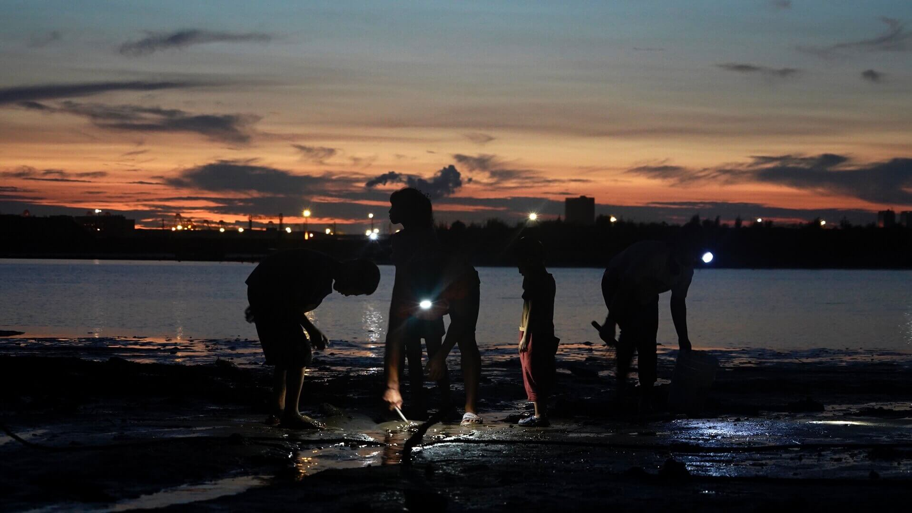

2022-10-02 钦州湾-广西

Hi，见信好，这是 321来信发出的第 20 封信。

本期包含以下内容：

AI 价值圈的代表公司以及赢家
休息不是无所事事，如何休息得更好
如何在互联网上建立朋友捕手
关键字：AI、休息、朋友捕手、思维、语言、准备

👍 推荐：

[Who Wins the AI Value Chain?](https://every.to/napkin-math/who-wins-the-ai-value-chain) - EVAN ARMSTRONG

最近 AI 界的一个新闻是 Stability AI 背后的初创公司 Stable Diffusion 筹集了 1.01 亿美元，我上次使用 Dall.E 2 生成了一些图片，效果惊人，目前除了 AI 作画、写作文外，已经训练出了使用 AI 来生成音频、视频的模型。

作者分析了 AI 价值链上的 5 个环节，认为销售或使用人工智能的公司将进行以下 5 环的一项，在某些情况下只有 1 家公司，但也有可能是多家公司。

例如在过去的 5 年中，该行业的大多数人都在 GPU 上使用了深度学习算法，所需的计算能力急剧增加。算力层中最接近的玩家是 Nvidia。他们的 GPU 是计算竞赛的首要主力，最好、最前沿的研究通常都需要 Nvidia 芯片，这也导致了公司的股价在过去的 5 年上涨了 141 %。而最接近的基础模型公司是 OpenAI，他们目前提供 2 个基础产品：Dall-E（图像生成模型）和 GPT-3（文本生成模型）。

- 计算：运行 AI 模型所需的芯片或服务器基础设施（Nvidia）
- 数据：用于训练模型的数据集
- 基础模型：计算和数据将与某种花哨的数学相结合，形成某种广泛适用的用例（OpenAI）
- 微调：大型基础模型如果不足以满足特定用例，则将针对特定场景进行调整 (Stable Diffusion)
- 最终用户接入点：然后将模型部署在某种应用程序中 (Copy.AI)

> AI is a power (in that it runs through an entire organization) and it is a product (in that it has its own ecosystem of support)

人工智能是基础设施还是产品的界定会比较模糊，简单的回答是两者都是，人工智能是一种力量（因为它贯穿整个组织），它也是一种产品（因为它有自己的支持生态系统）。这里作者举了电力的例子，当爱迪生首次引入商业照明并同时经营自己的发电厂时，它与电力的早期形态有着惊人的相似之处，电既是照明的能源也是一个产品。在 2016 年上一次 AI 热潮期间，Andrew Ng 曾经说过 “AI 就像电力”，因为它将会是一个基础的力量层，将改变一个行业的方方面面。

关于AI的未来

未来 AI 将作为基础架构设施服务以及提供模型微调能力，AWS、Oracle 和 Azure 等云提供商将构建自己的定制 AI 工作负载芯片，构建网络软件，并训练人们可以参考的内部模型并提供服务。例如 OpenAI 这样的公司将拥有庞大的业务，即销售对其基础模型的 API 访问权限，或者与公司合作开发大量部署的微调模型。

> Invisible AI is when a company is powered by AI but never even mentions it.

除此之外隐形人工智能公司同样不可忽视，隐形人工智能是指一家公司内容产品由人工智能驱动，但从未提及它，作者认为过去 10 年最成功的 AI 公司实际上是 TikTok 母公司字节跳动，他们的产品娱乐短视频，人工智能完全在后台，执行选择下一个要播放的视频的智力模糊任务。

[How to rest well](https://psyche.co/guides/how-to-rest-well-and-enjoy-a-more-creative-sustainable-life) - psyche.co

研究表明，良好的休息并不是无所事事，维多利亚时代的作家约翰·拉伯克（John Lubbock）在他的《生命的用途》（ The Use of Life ，1895）一书中写道：

> 休息不是无所事事，夏天偶尔躺在树下的草地上，听听水的潺潺水声，或看蓝天白云飘过，绝不是浪费时间。

如何休息得更好，作者是 Strategy and Rest 的创始人，这是一家位于硅谷的咨询公司，帮助公司设计和实施为期四天的工作周。文章的末尾给我们总结了文章的知识点：

- 休息的态度发生了变化，今天，将工作和休息视为对立面已变得司空见惯，但在人类历史的大部分时间里，我们可以为我们在劳动时使用的精神和身体电池充电的时间——也就是休息，被视为一种礼物。休息对于美好的生活和富有成效的职业与工作一样重要。

- 休息很重要。它可以让您充电，提高您的创造力，并有益于您的工作时间。

- 认真休息。为了收获休息的好处，你需要首先认识到它的优势，并在你的日程安排中为它留出确切的时间。

- 建立明确的界限。减少晚上和周末的工作电话和电子邮件检查；并认识到工作时间和个人时间之间的明确界限会使两者都更有效。

- 把休息当作一种技能。不要着急——你的大脑需要时间来开始利用休息的力量。

- 制定日历安排每日计划工作和休息。如果您可以控制自己的日常生活，请不要设计一个长时间不间断工作的工作日；取而代之的是利用交替进行不间断的、高度集中的工作和休息时间，为您的电池充电。

- 练习深度演奏。数量惊人的诺贝尔奖获得者、首席执行官、企业家和将军拥有严肃而苛刻的爱好，例如帆船、登山或绘画——它们提供了重要的消遣，提供与工作相同的回报，没有挑战。

- 不要忽视睡眠和小睡。小睡是白天充电的有效方式，而规律的睡眠模式有助于身体健康、情绪稳定和更健康的老龄化。

- 鼓励别人和你一起休息。我们越能更好地解决休息问题，我们就会越好。这意味着与家人建立新的休息习惯，与朋友建立新的沟通模式，与同事建立新的日常安排。

[Building friend catchers 建立朋友捕手](https://ferrucc.io/posts/friendcatchers/)

互联网上的偶遇给作者的生活带来很多乐趣，从那时起，互联网也是他结识朋友的主要方式之一。

关于如何在互联网上交到朋友，互联网非常适合组织信息并且找到自己喜欢的东西。friend catchers 是那些吸引观众并随着时间的推移然后能改进影响他们的东西，有可能上一个开发的应用，一篇深入解读问题的文章，一个被很多人赞叹或转发的回答。

另一个思路是分享你所拥有的两极分化的、非传统的想法。这些想法会排斥那些对你的想法持封闭态度的人，并吸引更多像你这样的人。如果你表达了你真正的兴趣，这股神奇的力量会将你介绍给志同道合的人，这些人会成为你最好的朋友、同事，有时甚至是恋人。

建立好朋友捕手的最好例子之一是彼得·泰尔，当他还是斯坦福大学的学生时，他于 1987 年创办了右翼出版物《斯坦福评论》，通过这个他认识看很多后来成为联合创始人或合作伙伴的朋友。即使是现在作为一个标志性的投资者，他仍然在花时间写论文和演讲，所有这些举措都是为了能够在他的生活中带来了更多潜在有趣的人。

ps：这份 newsletter 也是我的 friend catchers 之一，我期待能在互联网通过这些零碎的信息片段认识有趣的你。

💡 碎片

- 一个完全由人工智能生成的[播客](https://podcast.ai/)，其中乔·罗根采访了史蒂夫·乔布斯。
- 在北海第一眼看到这个招牌时还觉得挺有诗意的 ~

👀 思考

思维的具体化以及我们永远无法准备好

抱歉，我最近鸽了一期，因为上周国庆假期放假回来基本没有阅读，内容也没法凑够一篇。这里简单聊一下国庆假期出行记录的一些关键字以及最近感受。

广西边境公路自驾很有趣，我们在广西的西南角跑了一个小环线，途径南宁、北海、钦州、崇左、靖西、百色等地，我称之为“嗦粉之旅”，这趟旅途中经历了很多有意思的事情，也认识了有趣的人，在一些特定的场合中脑海里迸发出了很多有趣的想法，本来想展开讲讲这次的旅途趣事，但现在再回头去回忆它，这会故事却没有很具体、似乎忘得差不多了，感觉像你吃过一个很好的东西，但是你却怎么也想不起它的名字以及当时吃它的感受。

好在路上我也有随手在备忘录记下一些关键字，今天我再次去翻看的时候，发现很有趣，上面杂七杂八陆续记录了很多单个词汇或短句，有 “螃蟹皇帝螺”、“东北人”、“相信大数据的力量”、“成年人不要随便签字”、“浪花批发”、“挂在门上的香蕉”、“猪的一生”，“看日出想到的那个人”... 回忆逐渐变得清晰起来，因为每一个词都能让我联想展开一段小故事。

关于“螃蟹皇帝螺”，记得是在涠洲岛被当地电瓶车师傅带路海鲜店被坑，我们进店点菜后才想起要不打开美团点评看下，一看饭店 2 点多评分，评论里一溜的全是黑店、孙二娘店、快逃，当时恨不得有个隐身功能原地消失，好在最后编了个理由逃出来了，后来因为这事还认识了同样进了黑店的一对小情侣，据他们描述吃饭点菜时还在菜单上签了字，最后导致被坑，我们还拉了一个群，群名就是这 5 个字，当时记了“相信大数据的力量”，“成年人不要随便签字”...不过这个确实是真的要慎重，我的身边已经发生过很多起因为签字按手印吃亏的事情，所以记住后面这句话，很重要。“东北人”是因为类似我在海南岛，在广西也碰到被东北人坑，当然这里没有地域歧视的意思，有可能只是我的刻板印象。而“猪的一生”是在百色吃爆浆烤猪眼的时候被烫到，朋友说我们吃了猪的一生，所有它看到的东西，恩！滚烫的人生...

好记性不如烂笔头不无道理，也很有意义，我们尝试着用语言文字记录思考片段，其实在帮助大脑群体神经细胞的兴奋脉冲更好地工作，思维和记忆在脑海里都是很散落、模糊的，当我们用语言或文字去组织记录的时候，它开始变得具体，也更容易被大脑记住。思维是一个很抽象的词，如果你多读几遍，仔细地去想这两个词，甚至会变得很陌生，忘记它原本的意义。思维到底是什么？我们去想事情去思考的过程是通过观察现象、语言归纳具体化并做出推论，最终有可能引发行动，思维是我们认识外部世界的一个途径，是我们整合表象、语言、概念的一个过程。

另外发现写作也是有惯性的，一旦有了思路或想法可以写很多，但一旦偷懒歇下来很难再把之前的想法补充完整。每次如果我动手写，我总是能完成一篇内容，我的一个问题是一直觉得我应该看完这本书、调研完一个主题才能完成接下来的这篇 newsletter，但实际上总会因为各种原因耽搁，有的时候觉得内容不够好推倒重来，有的时候想好了主题却缺乏相关的内容及想法无法成篇，最近的思路就是随时随地记录当下的一些想法，然后再找时间补充完整。我在 jiayuan 的这篇文章里学到了新的写作方法，他的文章提到了 YC 创业营 Alan Chan 的创业故事，他在创业笔记文章里写到:

> 我根本就不應該去想「MVP 要有哪些功能才能 launch，做出這些功能要花多少時間？」，而是要想「我們明天要 launch，今天最多可以做到什麼程度的 MVP？
> MVP 推出去功能太少、太爛、沒有人用，這些一點都不是問題。每一次更新 MVP 都是一次學習、一次揮棒。揮棒多了才有可能打安打、打全壘打。MVP 從來都不該一次到位，而是要能高速迭代、變得愈來愈好。
应该像发布 MVP 产品一样来发布 newsletter，如果明天就进行投递，你能发布什么内容，而不是你慢慢准备好所有内容再发布。

在国庆的旅途出发前，我们详细规划了路线、每日行程，预订沿途景区门票、食宿酒店等，但疫情防控时期的假期出行也给我们上了一课，需要为各种突发情况额外预留时间，例如堵车、因为疫情防控政策变动导致的景区出入限制、航班变动等等，之前的一些准备其实也并没有派上大用场，计划总是赶不上变化，计划如何应对变化才是最好的计划。

Tim Cook 在一次哈佛毕业典礼的演讲中提到：“你的导师可能会让你去做准备，但他们无法让你准备好。”，你会发现当你的机会到来的时候，当那一天到来的时候，你根本没法完全准备好。但这并没有什么问题，我们并不需要凡事深思熟虑准备好，甚至刻意去模仿别人，在准备这件事上浪费过多的时间，而是应该内心强大到随时可以迎接挑战，在做的过程中去调整。你不可能一直在准备，你也永远无法完全 Ready，不管是旅游还是写作、工作、创业、恋爱等等，甚至是死亡这件事上。

最后，这里引用分享上周的回信里一位叫 Nemo 的读者回信，谢谢他给我分享整理的语言与思维关系的一些内容，希望你们也能有所启发和收获：

这里引用分享上周回信里一位叫 Nemo 的读者的回信，谢谢他给我分享了一些整理的语言与思维关系的内容：

> "徐默凡在华东师大中文系的开学典礼上提到，我们羡慕和赞叹语言的美丽的同时，要注意语言文字存在的陷阱，例如我们在形容一个人的时候容易给人贴标签，会立马想到一个个词来形容他，往往会具体归类到那一类人，并且对他进行分类。例如我们经常被问到该内卷还是躺平时，这个问题本身已经陷入“强行分类”的陷阱了"

最近看了一些语言和思维关系的内容，看到这段话又想起了一些 ，想分享给你，也顺便整理整理自己的思路～

1、大脑是“懒惰”的，是追求低耗能的，所以大脑特别喜欢贴标签，便于大脑自己理解，也便于大脑转化成语言讲述给其他人。

2、思维是立体的、混沌的三维信息，语言是把思维具像化之后的二维信息。语言是有局限的，很多东西是无法用语言描述的。

3、从思维到语言的降维过程中会丢失很多信息，很多时候这些丢失的部分是更重要、更接近本质的。例如爱情中那些不能用语言描述的部分。

4、人们经常会忘记语言是有局限的，认为语言表达的就是真理的全部。特别是你信任的人描述出来的时候，人很容易认为事情就是那样的。

5、语言也是在反过来影响和塑造思维的。

6、有些事情在脑袋里比较模糊，但是一旦你把它用语言描述出来之后，它就被映射成具体的、可描述的、看得见摸得着的东西了。我们大脑就能理解它、记住它、发展它了。例如，听播客的时候主播的某句话会让你觉得恍然大悟，那就是把你大脑里思考了很长时间的东西给具像化了，让你能理解它了。

7、在没有收集足够多的信息or时机不合适的时候，你非要把一个东西具像化，很可能得到的是一个残缺的、错误的结论。

例如 在谈恋爱的时候，在关系没发展到合适的时候，你非要追问对方「你到底喜不喜欢我啊？」 这个时候对方可能还没想好，但你非得逼着她回答，她大概率给出的是不那么准确的结论，然后大脑就会不自觉的找理由去反复佐证强化这个结论。

8、当别人问你一件事，你又不是真正了解这件事的时候，人很容易因为自尊心、虚荣心发表某种观点。

这个时候你只是在根据一些不完整的信息强化一些错误的观念而已。

9、很多商家会告诉你 「你穿xx才是成功人士」「你用xx才是好的生活」「你去xx才能净化心灵」

这是在用语言来框住你的思维

什么是好的生活？什么是自由到底是由谁来决定的呢？为什么要把定义自己生活的权利让渡给商家或者微信公众号呢？

以上就是第 #19 期的全部内容了，感谢你读到这里，希望你读完这封信后也有一些收获，也欢迎回信与我分享交流。如果你喜欢这个 Newsletter，别忘了订阅及转发这个地址: 321来信 来告诉你的朋友 ❤️。
我们下周二见 👋

Made with ❤️ by @wutopia

往期来信：

[# 18 🇨🇳 静默离职](https://321laixin.zhubai.love/posts/2187791651622936576)
